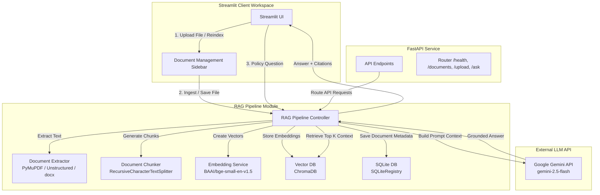

# GRC Compliance Assistant

A lightweight, local-first Retrieval-Augmented Generation (RAG) compliance assistant designed to help employees understand and follow Governance, Risk, and Compliance (GRC) policies. The system is designed to run efficiently on employee laptops using only CPU and minimal RAM, querying company policies securely with a fully grounded posture.

---

## Architecture Diagram



---

## Tech Stack

*   **Frontend**: Streamlit (Premium dark mode UI with IBM Plex fonts, real-time feedback, operational status board, confidence indicators, and document-scoped chat)
*   **Backend**: FastAPI (Restful API for document indexing, listings, status checks, and question answering)
*   **Document Extraction**: PyMuPDF (PDF), Unstructured / python-docx (DOCX), Unstructured / raw fallbacks (TXT)
*   **Chunking**: LangChain `RecursiveCharacterTextSplitter` (chunk_size=500, chunk_overlap=100)
*   **Embedding Model**: `BAAI/bge-small-en-v1.5` executing locally on **CPU** with caching
*   **Vector Database**: ChromaDB (Cosine similarity local persistent storage)
*   **LLM Service**: Google Gemini API (`gemini-2.5-flash`)
*   **Database Registry**: SQLite (Document metadata registration)
*   **Configuration**: Dotenv (`.env`)
*   **Testing Suite**: pytest

---

## Project Structure

```text
grc-chatbot/
├── app.py                      # Streamlit UI Startup Entrypoint
├── main.py                     # FastAPI API Startup Entrypoint
├── backend/
│   ├── api.py                  # FastAPI Application Endpoints
│   └── config.py               # Application Config (dataclass Settings)
├── ingestion/
│   ├── chunker.py              # Recursive Text Splitter for documents
│   └── loader.py               # Text loaders for PDF, DOCX, TXT
├── embedding/
│   └── embed.py                # Local CPU Embedding Service (sentence-transformers)
├── vector_db/
│   └── chroma_store.py         # Local Persistent ChromaDB Store
├── rag/
│   ├── pipeline.py             # Main RAG execution flow
│   ├── prompt_template.py      # GRC Assistant rules prompt
│   └── retrieve.py             # Top-K vector query and confidence scorer
├── llm/
│   └── gemini_client.py        # google-genai Client wrapper for gemini-2.5-flash
├── ui/
│   └── streamlit_ui.py         # Streamlit UI application dashboard
├── utils/
│   ├── logger.py               # Configured standard logging
│   └── security.py             # Sensitive data masking and filename sanitization
├── storage/
│   └── sqlite_store.py         # SQLite registry for uploaded document history
├── data/
│   ├── docs/                   # Stored uploaded files (uuid isolated)
│   └── vectors/                # Local ChromaDB files
├── tests/                      # pytest test suites
│   ├── test_upload.py
│   ├── test_retrieval.py
│   ├── test_llm.py
│   └── test_end_to_end.py
├── .env                        # Local Environment Secrets & Parameters
├── requirements.txt            # Python Dependencies
└── README.md                   # Project Documentation
```

---

## Installation & Setup

### Prerequisites

*   Python 3.12 (Installed directly, no Docker or containerization)

### Step 1: Clone and Prepare Virtual Environment

```powershell
# Create virtual environment
python -m venv .venv

# Activate virtual environment (Windows Powershell)
.venv\Scripts\Activate.ps1
```

### Step 2: Install Dependencies

```powershell
pip install -r requirements.txt
```

### Step 3: Configure Environment Variables

Create a `.env` file in the root directory:

```env
GEMINI_API_KEY=your_google_gemini_api_key_here
GEMINI_MODEL=gemini-2.5-flash
TOP_K=5
CHUNK_SIZE=500
CHUNK_OVERLAP=100
EMBEDDING_MODEL=BAAI/bge-small-en-v1.5
```

---

## Running the Application

### Start the Streamlit Chatbot Workspace

Run the command from the project root:

```powershell
streamlit run app.py
```

This starts the local web interface (usually at `http://localhost:8501`) presenting the GRC Intelligence Workspace.

### Start the Backend REST API (Optional)

To expose the REST service for integrations:

```powershell
uvicorn main:app --reload --port 8000
```

---

## REST API Documentation

Detailed endpoints configured in `backend/api.py`:

*   **`GET /health`**
    *   *Description*: Service status indicator.
    *   *Response*: `{"status": "ok"}`
*   **`GET /documents`**
    *   *Description*: Retrieves a list of all indexed documents in the SQLite database.
    *   *Response*: List of document records (name, document_id, chunks, status, upload date).
*   **`POST /upload`**
    *   *Description*: Uploads a PDF, DOCX, or TXT file to be chunked, embedded, and indexed.
    *   *Form Data*: `file` (UploadFile multipart)
    *   *Response*: JSON containing the assigned `document_id`, filename, chunks generated, and target path.
*   **`POST /ask`**
    *   *Description*: Queries the index using the local RAG pipeline.
    *   *Request Payload*:
        ```json
        {
          "query": "What is the password policy?",
          "document_id": null
        }
        ```
    *   *Response*: Grounded answer text, citations (source filename, page number, distance), and a confidence score.

---

## GRC Prompt Rules & Safety Compliance

The LLM is strictly constrained via `rag/prompt_template.py` to:
1.  Answer **ONLY** using retrieved context.
2.  State `"I could not find this information in company policies."` if the information is missing from the context.
3.  **Always** cite source filenames and page numbers for every claim.
4.  **Never** hallucinate or invent compliance requirements outside the context.
5.  Perform automatic PII/secret masking (e.g. emails, API keys, passwords) on both incoming queries and document texts before sending them to the LLM (implemented in `utils/security.py`).
6.  Maintain absolute file-level isolation via document-focused retrieval context filters.

---

## Running Tests

Verify code logic and correctness across loaders, embedders, database, retrieval, and prompt generation:

```powershell
.venv\Scripts\python -m pytest
```
